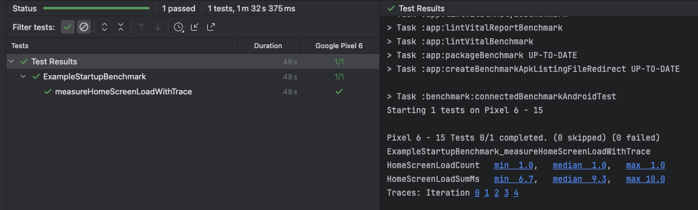

## MacroBenchmark
- 앱을 시작하거나 스크롤, 애니메이션 등의 복잡한 UI 조작 등을 측정하는데 사용한다.
- 지정한 횟수 만큼 테스트를 진행하며 최소 / 중간 / 최대 시간을 측정한다.
- 테스트를 마치면 Profile을 제공해준다. 이를 통해 세부 데이터를 살펴볼 수 있다.

 
### 사용법
- benchmark 모듈을 추가한다.
- 사용자와 동일한 환경 구성을 위해 release variants 기반으로 테스트를 진행한다.
- app 모듈에서 benchmark에 해당하는 buildTypes을 추가한다.
- benchmark 모듈에 compileOptions와 kotlinOptions를 설정한다.

### 측정 항목
- StartupTimingMetric 
  - 앱 시작(Cold, Warm, Hot Start) 시 앱 프로세스 생성부터 첫 화면이 완전히 렌더링 될 때까지 걸린 주요 시간들을 자동 측정한다.
  - 앱이 최초 실행부터 첫 UI 도달까지 얼마나 걸리는지 측정한다.
    - timeToInitialDisplayMs: UI가 표시될 때까지의 시간
    - timeToFullDisplayMs: 모든 네트워크, 이미지 로드 등 비동기 작업까지 완료되어 화면이 완전히 보일 때까지의 시간
- FrameTimingMetric 
  - 앱 실행/애니메이션/리스트 스크롤/화면 전환 등의 UI 프레임 별 렌더링 성능을 측정한다.
    - frameDurationCpuMs : 각 프레임의 CPU에서 처리에 걸린 시간 
    - frameDurationGpuMs : 각 프레임의 GPU에서 처리에 걸린 시간 
    - jank: 16.67ms(60Hz 기준) 이상 소요된 프레임(즉, 눈에 띄는 끊김 발생수)
    - frameOverrunMs : 프레임 지연(딜레이)
- TraceSectionMetric
  - Trace.beginSection()/endSection()와 같은 코드를 직접 사용하여 특정 구간을 사용자 정의로 측정한다.
  - ex. 화면에 그려줄 데이터 수집의 전체 시간 측정
    - SectionNameCount: 측정한 트레이스 구간이 반복마다 몇 번 등장했는지 (정상적이면 1회)
    - SectionNameSumMs: 구간 전체 실행에 소요된 시간
   

### 사용 예시
