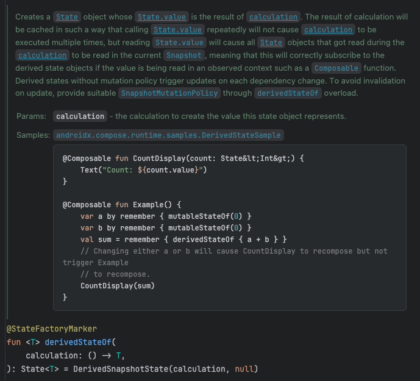

Compose API 중 리컴포지션을 최적화하는데 사용하는 `derivedStateOf`가 있다.

예시로 보면 a,b 값을 더한 sum이라는 변수에 `derivedState`를 사용하고 있다.
이를 통해 내부에 값을 계산해 State 객체를 생성하고 값이 노출되는 형태다.

이 노출이라는게 매번된다면 이를 관찰하고 있는 컴포넌트에선 매번 리컴포지션이 일어나 불필요한 리소스를 사용하게된다.

`derivedState`는 노출된 이후 값이 변경되는 시점을 계산하고 최소한의 노출을 제공하여 리컴포지션을 최소하한다.

가령, 로그인 화면이 있다고 할 때 사용자 이벤트를 받아 로그인을 요청할 수 있는 조건이 충족될 때 로그인 버튼이 활성화 되는 상황을 가정해보면

`derivedState`를 사용함으로써 활성화 / 비활성화 상태를 최소한으로 변경할 수 있다.