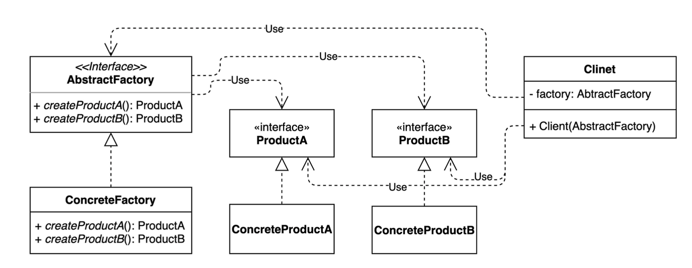

## 추상 팩토리 패턴

추상 팩토리 패턴은 상세화된 서브클래스를 정의하지 않고도 서로 관련성이 있거나 독립적인 여러 객체의 군을 생성하기 위한 인터페이스를 제공하는 패턴이다.

추상 팩토리 패턴은 객체의 생성, 표현, 구성과는 무관하게 시스템을 독립적으로 만들고자 할 때 유용한 패턴이다. 

여러 클래스들 중에 하나를 선택해서 시스템을 설정해야하고 한번 구성한 제품을 다른것으로 대체하거나 추가할 때 사용한다.

---

## UML


---

## 예시 코드
프레임과 휠이 들어가는 두개의 자동차를 만든다고 가정한다.

자동차에 필요한 부품을 만들고 자동차 모델에 맞는 공장에 배분한다.

자동차 생산 시 해당 공장에 접근하여 프레임과 휠을 요청한다. 

### 부품
Product
```kotlin
interface Frame {
    fun shape()
}
```

```kotlin
interface Wheel {
    fun size()
}
```

### 자동차 부품
AbstractProduct / 각 타입의 제품들을 추상화한 인터페이스
````kotlin
class AvanteFrame: Frame {
    override fun shape() {
        println("HyundaiFrame shape")
    }
}

class AvanteWheel: Wheel {
    override fun size() {
        println("HyundaiWheel size")
    }
}
````

### 자동차 공장
AbstractFactory / 최상위 공장 클래스로 여러개의 제품들을 생성하는 여러 메소드들을 추상화 한다.
```kotlin
interface CarFactory {
    fun createFrame(): Frame
    fun createWheel(): Wheel
}
```

### 아반떼 공장
ConcreteFactory / 서브 공장 클래스들은 타입에 맞는 제품 객체를 반환하도록 메소드들을 재정의한다.
```kotlin
class AvanteFactory: CarFactory {
    override fun createFrame(): Frame = AvanteFrame()
    override fun createWheel(): Wheel = AvanteWheel()
}
```

### 아반떼 생산
Client / Client는 추상화된 인터페이스만을 이용하여 제품을 받기 때문에, 구체적인 제품, 공장에 대해서는 모른다.
```kotlin
fun main() {
    val avanteFactory = AvanteFactory()

    // Product, 각 타입의 제품 구현체들. 이들은 팩토리 객체로부터 생성된다.
    val avante = Car(
        avanteFactory.createFrame(),
        avanteFactory.createWheel()
    )

    avante.frame.shape()
    avante.wheel.size()
}
```

추상 팩토리 패턴의 가장 큰 장점은 새로운 클래스나 인스턴스를 쉽게 추가 및 교체할 수 있는 것이다. 

현대 계열의 다른 차종 소나타나 그랜쳐를 추가한다면 각 챠량의 공장을 추가하고 클라이언트가 구현체에 접근하면 된다.


