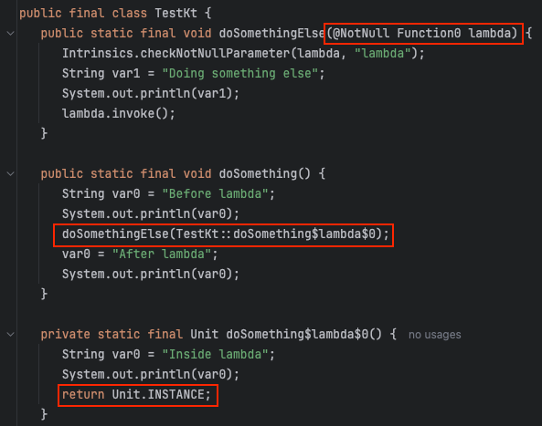
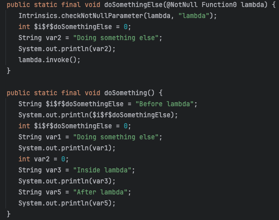

코틀린에서 `inline` 키워드를 사용하는 이유를 알아본다.

일반적으로 람다 / 고차 함수 호출 시 성능 개선하는 효과가 있다고 하는데 어떻게 성능을 개선하는걸까

아래 두개의 함수가 있다고 가정해보자.

```kotlin
fun doSomethingElse(lambda: () -> Unit) {
    println("Doing something else")
    lambda()
}

fun doSomething() {
    println("Before lambda")
    doSomethingElse {
        println("Inside lambda")
    }
    println("After lambda")
}
```
`doSomethingElse` 함수에서는 람다식을 받아 메세지 출력이후 이벤트를 호출해준다.

문제는 Java코드로 디컴파일해보면 알 수 있다.



`doSomethingElse`의 파라미터로 새로운 객체를 생성하여 넘겨주고 있다.

이는 무의미하게 새로운 객체를 매번 생성하는 것으로 보인다.

---



`inline`키워드를 `doSomethingElse`에 붙이고 다시 디컴파일 하였을 때 코드다.

람다식을 사용했을 때 무의미한 객체 생성을 하지 않고 코드 자체가 복사되는 것을 알 수 있다.

무의미한 객체가 생성되지 않는 것은 좋지만 이렇게 코드 자체가 복사가 된다는 것은 그만큼 바이트 코드 크기가 증가한다는 것을 의미한다.

따라서 큰 함수에는 사용하지 않아야 한다.

---

결론적으로 

람다/고차 함수 사용 시 `inline` 키워드를 사용하면 익명 클래스(+ 람다 인스턴스) 생성에 드는 오버헤드가 줄어 성능이 개선된다.
